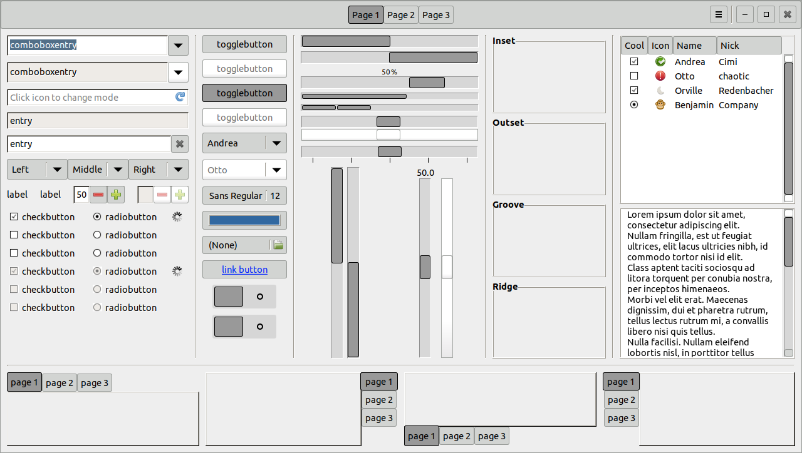

Raleigh Reloaded GTK Theme
==========================
This is a `GTK-3.20` theme aiming to revive the classic `Raleigh` theme. It is a minimal theme written from scratch completely. For that reason, some elements may be unstyled and therefore look ugly.

This theme has been developed on `Debian` with `Mate Desktop` and tested on most of the default-installed applications and on `gtk3-widget-factory` and the [`A Widget Factory`](https://github.com/valr/awf) as well. On the contrary, this theme was not tested on another desktop environments. If you are interested in extending support to any other desktop environment, do not create a feature request but implement it and send me a pull request to merge.

Preview
-------

Notes on Compatibility
----------------------
* The theme does support `GTK-2.0` and `GTK-3.20` but not the older `GTK-3.*` versions.
* The same widgets are rendered in different ways in `GTK-2.0` and `GTK-3.0`. Therefore, it is not possible to tune all the `GTK-3.0` elements to be absolutely the same like corresponding elements from `GTK-2.0`.
* Some programs require additional hacks that cannot be integrated into the main stylesheet. In those cases, the user must use a program-specific stylesheet, if the program supports it. For more information about some known cases, see the [doc](doc) directory.

Licensing Notice
----------------
This software is released under the terms of the GPL license version 2 as published by the Free Software Foundation. You can freely redistribute and/or modify the software under the terms of the license.

This program is distributed in the hope that it will be useful, but WITHOUT ANY WARRANTY; without even the implied warranty of MERCHANTABILITY or FITNESS FOR A PARTICULAR PURPOSE. See the GNU General Public License for more details.

For more information on details of the license, see the file [LICENSE.md](LICENSE.md).
